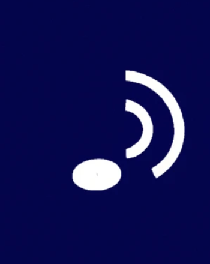

# Sound Switch 

This started out as a way of matching vocalisations in a really reliable way rather than just relying on amplitude 

We have a little app that listens to the mic and compares it to sound samples. So You need to get short, clean sound samples as wav files, put them in the sound-samples directory and run the system tray app.

It will then listen to the mic in the computer. 

You can have a look at some of the experiments that led to this in the directory. 

## Get up and running

1. You need to make sound samples of your vocalisations. Keep them short and as clean as possible using the same recording technique. Save them as wav's. You can use the 'SoundSampleRecoder' which is included if you wish - although you may need to trim the sound clips. 
2. [Download and install the app](https://github.com/AceCentre/SoundSwitch/releases/latest/download/SoundSwitchInstaller.exe)
3. Set the key stroke it is sending and other aspects in the config [See here](https://pyautogui.readthedocs.io/en/latest/keyboard.html#keyboard-keys)

Re: correlation_threshold

correlation_threshold is a critical parameter that determines the sensitivity of the audio detection algorithm. It sets the minimum value that the cross-correlation between the real-time audio and the audio samples must reach for a match to be considered valid.
A higher value makes the program less sensitive (fewer false positives), but it might miss some instances of the target sound. Conversely, a lower value makes the program more sensitive (more false positives) but increases the likelihood of detecting softer occurrences of the target sound. **It ranges from -1 0 1**. A typical value maybe 0.8

## Code Structure

- load_samples(): Loads audio samples from a designated folder.
- findAudioDevices(): Lists available audio input devices.
- detect_ahh(): Performs cross-correlation to detect specific sounds.
- detection_loop(): Main loop where real-time audio is processed.

